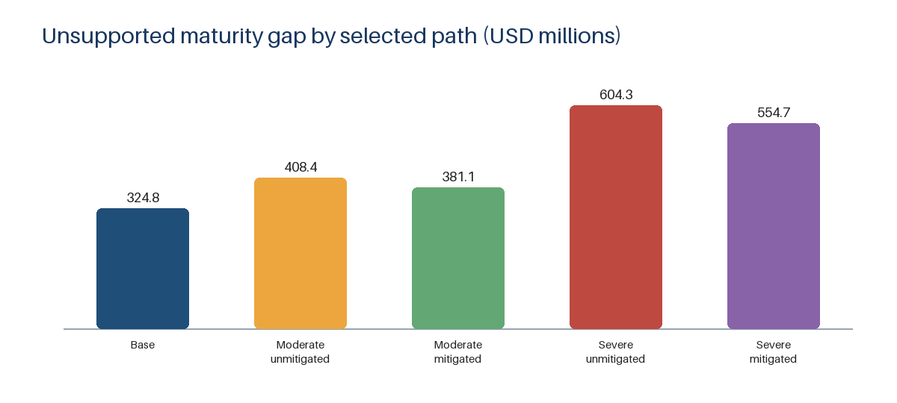

# Quanex credit underwriting

## Credit question and final recommendation

Should a lender support Quanex Building Products Corporation's hypothetical post-Tyman refinancing? The public-information underwriting recommendation is **Conditional Approval — proceed with diligence and definitive documentation.** **No final commitment or funding authorization exists until all material conditions are satisfied.** All 18 Phase 10 decisions are `owner_reviewed`; this is a portfolio-project recommendation, not actual bank approval, a legal opinion, an official rating, or an assertion of contractual compliance.

## Transaction snapshot

| Item | Selected treatment |
| --- | --- |
| Borrower | Quanex Building Products Corporation |
| Facilities | $635m fully funded term facility; $300m revolver |
| Opening revolver draw | $29.898m |
| Combined bank hold | Up to $50m |
| Conditional source | $15m non-debt source; it may not be replaced with additional debt |
| Term amortization / ECF sweep | 7.5% annually / 50% |
| Operating cash floor / covenant cash netting | $25m / zero |
| Maturity | January 31, 2031 |
| Committee date and information cutoff | December 15, 2025 |
| Hypothetical projected closing | January 31, 2026 |

## Decisive findings

- Historical cash generation improved after the Tyman acquisition: FY2025 lender-base EBITDA was $225.344m, CFO was $164.897m, and CFO less capital expenditures was $102.255m. Acquisition comparability and the $302.284m goodwill impairment remain major cautions.
- The October 31, 2025 historical reference is $641.250m bank debt plus $62.619m retained lease/other debt, or $703.869m total funded debt. At the January 31, 2026 projected closing, existing / reference / selected total funded debt is $732.517m / $742.517m / $727.517m. Selected is $5.000m below projected existing only because the conditional $15m non-debt source exceeds assumed $10m fees; if unavailable, resize, obtain another acceptable non-debt source, or do not close—never substitute debt.
- Selected opening gross leverage is 3.2285x. Base all-in liquidity is $263.902m, a point-in-time opening measure rather than recurring annual cash generation.
- At the July 31, 2029 common horizon, selected total funded debt is $514.754m, versus $495.368m under the existing facilities and $507.954m in the reference structure. Selected is $19.385m above existing, so the selected path is not justified by faster same-horizon debt reduction.
- Both moderate cases warn and breach on October 31, 2026; maximum quarterly-test leverage is 4.4893x unmitigated and 4.4670x mitigated, and mitigation does not restore compliance. Severe cases exhaust liquidity and fail mandatory payments. The selected structure still has a $324.780m point-in-time bank-debt gap at January 31, 2031, so refinancing remains a material, separately underwritten dependency.

## Deliverables

- [Credit memo (PDF)](reports/credit_memo.pdf)
- [One-page committee brief (PDF)](reports/committee_brief.pdf)
- [Excel underwriting model](model/Quanex_Credit_Underwriting.xlsx)

## Overview visual



The chart compares point-in-time unsupported bank-debt gaps for selected-structure scenarios at the January 31, 2031 maturity. It is not the July 31, 2029 common-horizon comparison above.

## What differentiates the project

- Source-traceable FY2021-FY2025 historicals preserve reported, pro forma, calculated, and lender-normalized layers.
- Owner-reviewed EBITDA adjustments remain separate from contractual eligibility and cash-flow treatment.
- One formula-driven workbook links historicals, forecast cases, debt, liquidity, covenant intervention, monitoring, and alternative recovery sensitivities.
- Downside results distinguish covenant breach, drawability, liquidity exhaustion, mandatory-payment failure, maturity gaps, and recovery.
- Reproducibility controls use committed evidence only, compare deterministic artifacts exactly, compare the workbook semantically, and keep write-producing checks in disposable environments.

## Methodology and tools

Phases 0-10 establish evidence, historical spreading, credit adjustments, borrower drivers, debt terms, the base case, downside cases, covenant sizing, the Excel model, recovery and monitoring, and the final committee package. Phase 11 adds release QA only; it does not change the underwriting.

The analytical Python workflows use the standard library and no live network input. Workbook generation uses the bundled `@oai/artifact-tool`; LibreOffice performs the reproducible full recalculation; Microsoft Excel is a separate compatibility gate. PDF generation uses the bundled ReportLab, Pillow, and pypdf runtime. See [reproducibility instructions](docs/phase-11/REPRODUCIBILITY.md) and [methodology](docs/phase-11/METHODOLOGY.md).

## Reproduction and validation commands

From the repository root on the tested Windows environment:

```powershell
python -B scripts/phase11.py all --base <base-sha> --overlay-manifest <manifest-path>
python -B scripts/phase11.py validate
python -B scripts/phase11.py verify-overlay --base <base-sha> --overlay-manifest <manifest-path>
python -B scripts/phase11.py verify-release --commit <candidate-sha>
```

`all` validates the pre-generation manifest, generates only the fixed Phase 11 output inventory, and uses the declared pre-commit overlay in a disposable local clone. Refresh the external manifest from the final working-tree status after generation; `validate` is read-only against that refreshed inventory, and `verify-overlay` reviews it without establishing a clean release. After commit, `verify-release` repeats write-producing builds, complete tests, spreadsheet-engine checks, and comparison controls from the explicitly selected clean commit with zero overlays, then confirms the source manifest, HEAD, and Git status did not change. No SEC or other live analytical retrieval is required. Exact prerequisites and the underlying command order are documented in [REPRODUCIBILITY.md](docs/phase-11/REPRODUCIBILITY.md).

Full regeneration is established only for the documented Windows environment and depends on the documented Python, Node.js, `@oai/artifact-tool`, Microsoft Excel, LibreOffice, and PowerShell toolchain; compatibility in other environments is untested.

## Limitations

This is public-information underwriting frozen at December 15, 2025, with a hypothetical January 31, 2026 closing. It has no management forecast, private diligence, official compliance certificate, final legal definitions, or verified closing coverage. Pricing, fees, hedging, syndication, collateral, guarantees, perfection, priority, accessible cash, and the conditional $15m source remain unresolved. Historical acquisition comparability, scenario timing and seasonality, severe-stress payment failures, and material refinancing dependency limit the conclusions. Official facility recovery remains `N/D`; illustrative recovery values are not appraisals. The project does not map to a bank grade, agency rating, or probability of default, and spreadsheet results remain subject to the tested engine boundaries. See the [full limitations statement](docs/phase-11/LIMITATIONS.md).

Mandatory fallback if a material condition is not met: retain or amend the existing facilities through a limited amendment or extension. Do not replace the conditional non-debt source with more debt or weaken protections to make the transaction close.

## AI-use disclosure

I directed the project and retain responsibility for its underwriting conclusions. I made or approved the material analytical judgments. I reviewed and validated the resulting model, reports, and controls and tested key workbook behavior in Microsoft Excel. AI tools accelerated implementation through code drafting, repetitive extraction and normalization, artifact generation, test construction, and consistency checking; they did not independently make or approve the credit decision. See the [full AI-use and analytical-ownership disclosure](docs/phase-11/AI_USE_DISCLOSURE.md).

## Repository navigation

- `data/`: approved raw decisions and deterministic processed outputs by phase
- `docs/`: methodology, source ledgers, limitations, and handoffs by phase
- `model/`: authoritative Excel underwriting model
- `reports/`: decision-facing memo, brief, and charts
- `scripts/`: build, validation, spreadsheet, and document workflows
- `tests/`: decision-relevant regression and release-readiness tests

The repository has no license file. It is therefore all-rights-reserved by default pending an explicit owner licensing decision; see the [release checklist](docs/phase-11/RELEASE_CHECKLIST.md).

## Phase 8 Excel underwriting model

Phase 8 adds `model/Quanex_Credit_Underwriting.xlsx`, a 14-sheet formula-driven underwriting workbook with one live scenario selector, captured scenario comparisons, transaction, forecast, debt, liquidity, covenant, sensitivity, source and terminal-check views. LibreOffice 26.8.0.3 performs the required full recalculation and saves the Base scenario.

Reproduce and validate with:

```powershell
python scripts/phase8.py all
python -m unittest discover -s tests -v
```

The workbook preserves the approved Phase 7 provisional structure. At Phase 8 completion, recovery analysis and the final recommendation were still pending; those historical phase boundaries do not supersede the current **Conditional Approval** recommendation above. The conditional $15 million source, closing cash-interest evidence, legal definitions, and other stated diligence items remain unresolved.
